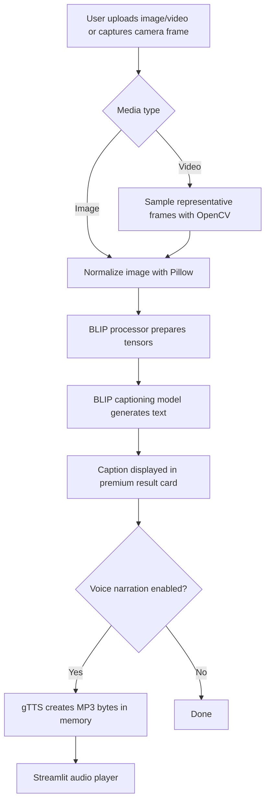

# AI Caption Studio

> Turn images, videos, and live camera frames into intelligent captions with optional voice narration.

AI Caption Studio is a polished Streamlit application that uses BLIP image captioning to describe visual media, summarizes uploaded videos by sampling representative frames, and can read generated captions aloud with text-to-speech.


---

## What It Does

- Captions uploaded images automatically.
- Captions uploaded videos by extracting and analyzing sampled frames.
- Captures camera photos through Streamlit.
- Supports live camera frame capture with `streamlit-webrtc`.
- Converts captions into MP3 voice narration with `gTTS`.
- Uses a custom dark glassmorphism UI instead of default Streamlit styling.
- Runs on CPU-friendly BLIP base by default for broader deployment compatibility.

---

## Experience

The interface is designed like a premium AI SaaS tool:

- dark navy-to-purple gradient background
- glassmorphism cards
- gradient hero typography
- pill-style media tabs
- styled validation and error states
- animated result cards
- responsive layout for smaller screens

---

## Tech Stack

| Layer | Technology |
|---|---|
| UI | Streamlit |
| Image Captioning | Salesforce BLIP via Hugging Face Transformers |
| Deep Learning Runtime | PyTorch |
| Image Processing | Pillow |
| Video Frame Sampling | OpenCV |
| Live Camera | streamlit-webrtc |
| Text-to-Speech | gTTS |
| Deployment Target | Streamlit Community Cloud |

---

## Project Structure

```text
real-time-img-caption-gen-BLIP/
|-- app.py                  # Streamlit UI and user flow
|-- requirements.txt        # Python dependencies
|-- runtime.txt             # Streamlit Cloud Python version
|-- src/
|   |-- __init__.py
|   |-- audio.py            # Caption-to-speech MP3 generation
|   |-- captioning.py       # BLIP model loading and inference
|   |-- config.py           # Model, generation, image, and video settings
|   |-- image_utils.py      # Image loading, orientation, RGB conversion, resizing
|   `-- video_utils.py      # Video frame sampling and frame-caption summarization
`-- README.md
```

---

## How The Pipeline Works



---

## Local Setup

### 1. Clone the repository

```bash
git clone https://github.com/MOHAMMED-GHANIM-SIDDIQUI/real-time-img-caption-gen-BLIP.git
cd real-time-img-caption-gen-BLIP
```

### 2. Create a virtual environment

```bash
python -m venv .venv
```

Windows:

```bash
.venv\Scripts\activate
```

macOS/Linux:

```bash
source .venv/bin/activate
```

### 3. Install dependencies

```bash
python -m pip install --upgrade pip
python -m pip install -r requirements.txt
```

### 4. Run the app

```bash
streamlit run app.py
```

Then open:

```text
http://localhost:8501
```

---

## Streamlit Cloud Deployment

Use these settings in Streamlit Community Cloud:

```text
Repository: MOHAMMED-GHANIM-SIDDIQUI/real-time-img-caption-gen-BLIP
Branch: main
Main file path: app.py
Python version: python-3.12
```

The repo includes:

```text
runtime.txt
```

with:

```text
python-3.12
```

This helps keep native WebRTC dependencies more stable on Streamlit Cloud.

---

## Live Camera Notes

Live camera support uses `streamlit-webrtc`.

For cloud deployment, the app includes a STUN configuration:

```python
RTC_CONFIGURATION = {
    "iceServers": [
        {"urls": ["stun:stun.l.google.com:19302"]},
    ],
}
```

If live camera works locally but not on Streamlit Cloud:

- reboot the Streamlit app after deployment
- check the Streamlit Cloud logs
- verify `streamlit-webrtc` and `aiortc` installed successfully
- if camera negotiation still fails, the browser/network may need a TURN server

---

## Configuration

Core settings live in `src/config.py`:

```python
CAPTION_MODEL_NAME = "Salesforce/blip-image-captioning-base"
CAPTION_PROMPT = ""
MAX_IMAGE_EDGE = 1024
VIDEO_SAMPLE_FRAMES = 6
MAX_VIDEO_SIZE_MB = 100
```

The app intentionally uses BLIP base by default because it is more practical for CPU and Streamlit Cloud. Larger captioning models may produce richer descriptions, but they can be too slow or memory-heavy without a GPU.

---

## Troubleshooting

### `BlipImageProcessorFast requires the Torchvision library`

This project uses:

```python
use_fast=False
```

to avoid requiring `torchvision` for BLIP preprocessing.

### Live camera tab says WebRTC could not load

Check Streamlit Cloud logs for the exact import error. The app surfaces this error in the UI when import fails.

### Captioning is slow

The first run downloads and loads the model. Later runs are faster because the model is cached with Streamlit.

### gTTS audio fails

`gTTS` depends on external network access. If it fails, the app still shows the generated caption and displays an audio-only warning.

---

## Why This Version Is Improved

Compared with the original prototype:

- the model is cached instead of reloaded per request
- audio is generated in memory instead of writing a shared MP3 file
- image handling includes EXIF correction, RGB conversion, and resizing
- video uploads are supported through frame sampling
- live camera frame capture is supported through WebRTC
- code is split into focused modules
- dependencies are pinned for repeatable deployment
- the UI is redesigned into a modern AI product interface

---

## Author

Created by **MOHAMMED GHANIM SIDDIQUI**

If this project helps you, consider starring the repository.
